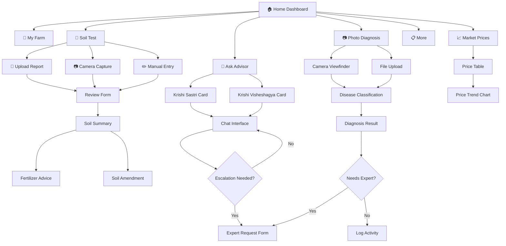

# Navigation & Screen Flow

> **Status:** Active
> **Last Updated:** 2026-07-04
> **Owner:** UX / Engineering

---

## Navigation Structure

The app uses a left sidebar navigation (collapsible on mobile) with 7 main sections:

```
🌾 Krishi Sampark
─────────────────
🏠  होम          (Home)
🌱  मेरा खेत      (My Farm)
🧪  मिट्टी जांच   (Soil Test)
💬  पूछें        (Ask)
📷  फोटो जांच    (Photo Diagnosis)
📈  मंडी भाव     (Market Prices)
📋  अन्य         (More)
```

## Screen Flow Diagram



## Screen Descriptions

### 🏠 Home Dashboard
- Greeting with farmer name and field summary
- Today's weather card (temperature, condition, rain probability)
- Moisture warning card (if applicable)
- Today's plan card (irrigation/fertilizer recommendations)
- Quick action buttons (voice ask, market prices, log activity)

### 🌱 My Farm
- Field cards with crop type, stage, health gauge, moisture gauge
- Telemetry charts (moisture, nitrogen, health over time)
- Activity log with timestamps
- Add field / edit field options

### 🧪 मिट्टी जांच (Soil Test)
- 3 entry options: Upload PDF/photo, Camera capture, Manual entry
- Review form: field selector, date, lab name, soil type, 10 soil parameters
- Summary screen: color-coded interpretations (🟢/🟡/🔴), expandable details
- Action buttons: Fertilizer advice, Soil amendment suggestions

### 💬 पूछें (Ask)
- Two advisor cards: Krishi Sastri (recommended) and Krishi Visheshagya
- Chat interface with message bubbles
- Escalation prompts with हाँ/नहीं buttons
- Expert request form (crop, symptom, photo, urgency)

### 📷 फोटो जांच (Photo Diagnosis)
- Camera viewfinder with capture button
- File upload fallback
- Classification result with disease name, confidence, treatment
- Expert delegation option for uncertain diagnoses

### 📈 मंडी भाव (Market Prices)
- Price table for 6 crops
- Trend indicators (up/down arrows)
- Historical price chart
- Currency in local format (₹/KSh)

## Related Documents

- [Farmer UX Guidelines](farmer-ux-guidelines.md)
- [Localization Guidelines](localization-guidelines.md)