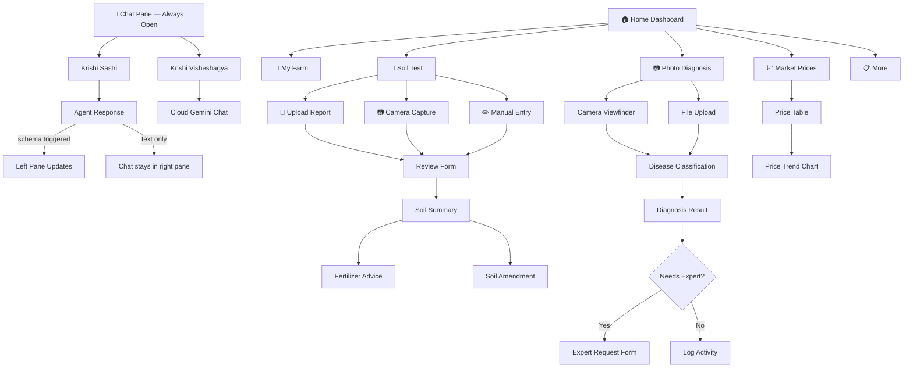

# Navigation & Screen Flow

> **Status:** Active
> **Last Updated:** 2026-07-05
> **Owner:** UX / Engineering

---

## Two-Pane Layout (v2)

The app uses a **two-pane layout** where the chat is always visible on the right and content panels appear on the left. This ensures the farmer never loses the conversation when the agent triggers a schema (e.g., irrigation planner, pest alert).

```
┌──────────────────────────────────────────────────────────────┐
│  Left Nav     │           Header                              │
│  (slide-over   ├───────────────────────┬───────────────────────┤
│   overlay,     │  LEFT PANE            │  RIGHT PANE            │
│   collapsible) │  (content/visuals)    │  (chat — always open)  │
│               │                       │                        │
│  🏠 Home      │  ┌─────────────────┐  │  ┌──────────────────┐  │
│  🌱 My Farm   │  │ Irrigation      │  │  │ Chat messages     │  │
│  🧪 Soil Test │  │ Planner / Farm  │  │  │ User: ...         │  │
│  📷 Photo     │  │ Dashboard /     │  │  │ Sastri: ...       │  │
│  📈 Market    │  │ Market / etc.   │  │  │                   │  │
│  📋 More      │  │                 │  │  │                   │  │
│               │  └─────────────────┘  │  ├──────────────────┤  │
│               │                       │  │ 🎙️ [input]  ➔  │  │
│               │                       │  └──────────────────┘  │
└──────────────────────────────────────────────────────────────┘
```

### Design Principles

1. **Right pane = chat (always visible)** — The Krishi Sastri / Krishi Visheshagya chat lives permanently in the right pane. It never gets replaced by schemas or navigation.
2. **Left pane = content area** — Shows whatever the left nav selects (Home, My Farm, Soil Test, Market, etc.) OR schemas triggered by the agent's response (irrigation planner, pest alert, etc.).
3. **Left nav = slide-over overlay** — On all screen sizes, the left nav slides over the left content pane as an overlay drawer. When collapsed, the content pane gets full width.
4. **Mobile behavior** — On narrow screens (< 768px), the chat pane slides in from the right as a full-height overlay, toggled by a floating 💬 button. The content pane takes full width.

### Agent Response Flow

When the agent responds with a schema (e.g., irrigation planner JSON), the schema renders in the **left content pane** while the chat stays in the right pane. The user sees both the answer and the visual tool simultaneously.

```
Agent response → detectAndRenderA2UI() → renders in .content-pane (left)
               → panelRouter.routeIntent() → loadSchema() → .content-pane (left)
               → Chat messages stay in .chat-pane (right, untouched)
```

## Navigation Structure

The left sidebar navigation (collapsible, slide-over) has these sections:

```
🌾 Krishi Sampark
─────────────────
🏠  होम          (Home)
🌱  मेरा खेत      (My Farm)
🧪  मिट्टी जांच   (Soil Test)
📷  फोटो जांच    (Photo Diagnosis)
📈  मंडी भाव     (Market Prices)
📋  अन्य         (More)
```

The chat (💬) is always accessible via the right pane (desktop) or the floating chat button (mobile).

## Screen Flow Diagram



## Screen Descriptions

### 🏠 Home Dashboard (Left Pane)
- Greeting with farmer name and field summary
- Today's weather card (temperature, condition, rain probability)
- Moisture warning card (if applicable)
- Today's plan card (irrigation/fertilizer recommendations)
- Quick action buttons (voice ask, market prices, log activity)

### 🌱 My Farm (Left Pane)
- Field cards with crop type, stage, health gauge, moisture gauge
- Telemetry charts (moisture, nitrogen, health over time)
- Activity log with timestamps
- Add field / edit field options

### 🧪 मिट्टी जांच (Soil Test) (Left Pane)
- 3 entry options: Upload PDF/photo, Camera capture, Manual entry
- Review form: field selector, date, lab name, soil type, 10 soil parameters
- Summary screen: color-coded interpretations (🟢/🟡/🔴), expandable details
- Action buttons: Fertilizer advice, Soil amendment suggestions

### 💬 Chat Pane (Right Pane — Always Visible)
- Advisor selection: Krishi Sastri (recommended) and Krishi Visheshagya
- Krishi Sastri chat: ADK multi-agent orchestration via `/run_sse`
- Krishi Visheshagya chat: Cloud Gemini via `/api/expert/chat`
- Voice input (mic button) and TTS auto-speak
- Agent-triggered schemas render in the left content pane, not replacing chat
- Escalation prompts with हाँ/नहीं buttons
- Expert request form (crop, symptom, photo, urgency)

### 📷 फोटो जांच (Photo Diagnosis) (Left Pane)
- Camera viewfinder with capture button
- File upload fallback
- Classification result with disease name, confidence, treatment
- Expert delegation option for uncertain diagnoses

### 📈 मंडी भाव (Market Prices) (Left Pane)
- Price table for 6 crops
- Trend indicators (up/down arrows)
- Historical price chart
- Currency in local format (₹/KSh)

## Responsive Behavior

| Breakpoint | Layout | Chat Behavior | Navigation |
|------------|--------|---------------|------------|
| < 768px (mobile) | Single column, content full width | Chat slides in from right via 💬 FAB button | Bottom nav bar (5 tabs) |
| 768px–1023px (tablet) | Two-pane side-by-side | Chat pane `clamp(300px, 32vw, 420px)` | Drawer sidebar (☰ toggle) |
| ≥ 1024px (desktop) | Grid with left nav sidebar + two-pane | Chat pane `clamp(300px, 32vw, 420px)` | Left nav always visible |
| ≥ 1400px (large desktop) | Wider content, more padding | Chat pane up to 460px | Left nav always visible |

See [Responsive Design](responsive-design.md) for full breakpoint details, device detection, and fluid design patterns.

## Related Documents

- [Responsive Design](responsive-design.md)
- [Farmer UX Guidelines](farmer-ux-guidelines.md)
- [Localization Guidelines](localization-guidelines.md)
- [Architecture Overview](../02-architecture/architecture-overview.md)