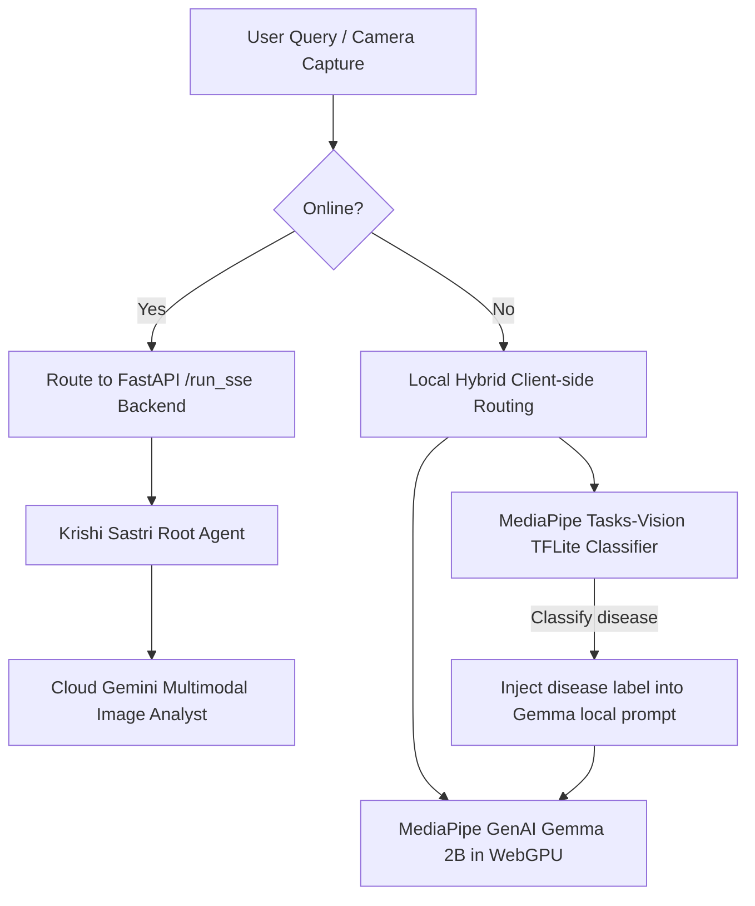

> **⚠️ SUPERSEDED** — This document is kept for historical reference.
> The authoritative version is now [docs/04-engineering/local-llm-and-device-capabilities.md](04-engineering/local-llm-and-device-capabilities.md).

---

# 🌾 Progressive Web App (PWA) & Local LLM Integration Plan

This plan details the implementation strategy for converting the **Krishi Sampark** dashboard into an installable, offline-first Progressive Web App (PWA) running browser-native local LLMs and local vision diagnostics.

---

## 🏗️ Architectural Overview

---

## 🎯 Key Decisions & Alignment

1.  **Pre-packaged Offline Models:**
    *   **Decision:** **Yes.** We will bundle a pre-packaged lightweight plant disease classification model (TFLite, `~15MB`) in the workspace directory under `ui/models/` to ensure immediate offline visual diagnostics are functional upon installing the PWA.
2.  **Hardware Requirements Warning:**
    *   **Decision:** **Yes.** We will display a clear warning if the user's mobile device lacks the necessary WebGPU/WebGL acceleration or has low RAM that might cause local Gemma model execution to crash. While modern high-end smartphones can run these models, budget and older mobile devices will benefit from clear guidance and a fallback mode.

---

## 🛠️ Technical Design

### Component 1: PWA Infrastructure (Offline Capability)
*   **Web App Manifest ([ui/manifest.webmanifest](file:///Users/nalin.giri/workspaces/agentic-agri-advisor/ui/manifest.webmanifest)):**
    *   Defines launcher icons, brand color themes (`#3E8E41`), display mode (`standalone`), and start URL (`/agui/index.html`).
*   **Service Worker ([ui/sw.js](file:///Users/nalin.giri/workspaces/agentic-agri-advisor/ui/sw.js)):**
    *   Implements a **cache-first strategy** for UI files (HTML, CSS, JS, Outfit Google Fonts) so the interface boots instantly without internet access.
    *   Implements a **network-first strategy** for active profile endpoints (`/api/profile/{farmer_id}`).
    *   Provides an offline fallback dashboard when FastAPI backend endpoints are unreachable.

### Component 2: Local AI Engines (Gemma 2B & TFLite Vision)
*   **Local LLM Web GenAI Worker ([ui/agui/local_models.js](file:///Users/nalin.giri/workspaces/agentic-agri-advisor/ui/agui/local_models.js)):**
    *   Initializes the MediaPipe Web LLM Inference API (`@mediapipe/tasks-genai`).
    *   Loads and compiles the local model task (e.g. Gemma 2B or Phi-2) using the browser's WebGPU context.
*   **Local Image Classifier:**
    *   Uses `@mediapipe/tasks-vision` to load the `~15MB` agricultural disease TFLite model from `ui/models/` to execute real-time image diagnostic runs directly inside the client context.

### Component 3: Camera Capture & Photo Diagnostics
*   **Inline Viewfinder ([ui/agui/camera.js](file:///Users/nalin.giri/workspaces/agentic-agri-advisor/ui/agui/camera.js)):**
    *   Accesses the rear camera (`facingMode: "environment"`) via HTML5 `getUserMedia`.
    *   Draws a live viewfinder layout and handles capturing image frames onto a hidden `<canvas>`.
    *   Provides standard file selectors (`<input type="file" accept="image/*">`) for compatibility fallbacks.

### Component 4: Hybrid Agent Routing & Offline DB
*   **Connectivity Triage (`dashboard.js`):**
    *   Monitors `navigator.onLine`.
    *   *Online Route:* Routes reasoning to backend `/run_sse` (which connects to the FastAPI Python agents).
    *   *Offline Route:* Passes crop images to the local TFLite classifier, then injects detected labels into the local WebGPU Gemma prompt to output diagnostic descriptions to the farmer.
*   **Offline Data Store ([ui/agui/local_db.js](file:///Users/nalin.giri/workspaces/agentic-agri-advisor/ui/agui/local_db.js)):**
    *   Stores active profiles, local crop states, and offline chat histories inside the browser's **IndexedDB**.
    *   Queues telemetry changes and auto-syncs them to the backend SQLite DB once network access returns.
