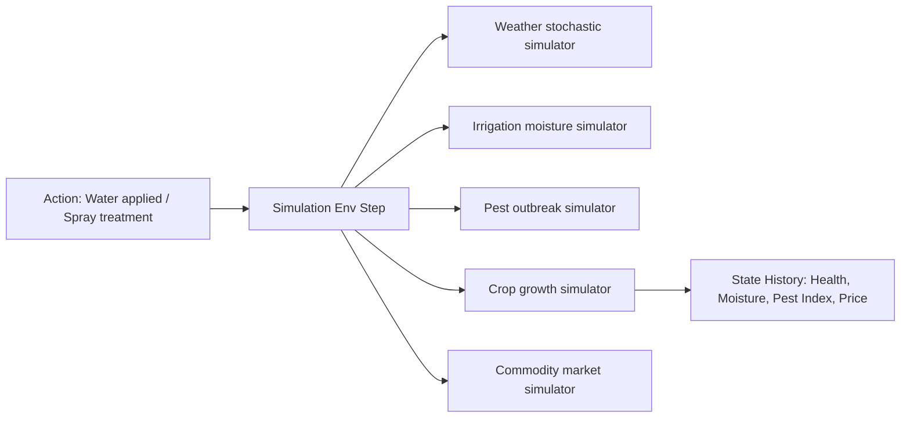

# 🌾 Agentic Agriculture Advisor (AAA): Technical Architecture Guide

This document provides an in-depth technical analysis of the Agentic Agriculture Advisor (AAA) platform, detailing the backend systems, multi-agent coordination architecture, simulation sandbox dynamics, data orchestration pipelines, and declarative user interface protocols.

---

## 🎯 Platform Overview

The Agentic Agriculture Advisor is an agricultural advisory platform designed for smallholders. It incorporates:
1. **Multi-Agent Orchestration (Router-Specialist Pattern):** Powered by the Google Agent Development Kit (ADK).
2. **Dynamic UI Card Rendering (A2UI):** Empowers agents to emit structured UI components dynamically rendered by the client dashboard.
3. **Multilingual and Local Speech Support:** Instant offline browser translation and unmetered speech synthesis engines for regional dialects.
4. **Farm Twin Database Sync:** Active sqlite model of fields, soil profiles, crop variety, and telemetry logs.
5. **Gym-Style Simulation Sandbox:** Local environment representing crop hydration, hazard dynamics, pest infestation, and market fluctuations.

---

## 🏛️ System & Folder Architecture

```
agentic-agri-advisor/
├── agents/                  # Specialist Python ADK Agent definitions
├── ui_agents/               # JS/TS ADK Client-side UI Agent definitions
├── mcp_servers/             # Model Context Protocol servers
├── okf-knowledge-graph/     # Open Knowledge Graph schema assets
├── rag_pipeline/            # RAG manual ingest and search indexing
├── ui/                      # A2UI & AGUI Client Assets
├── simulation/              # Farm environment sandbox simulator
├── data/                    # SQLite database scripts and storage
└── app/                     # FastAPI core server & endpoints
```

---

## 🧠 Multi-Agent Orchestration

The platform implements a decoupled, hierarchical multi-agent team structure using the Google ADK and Antigravity SDK:

### 1. Root Agent: Krishi Sastri ([agents/coordinator/agent.py](file:///Users/nalin.giri/workspaces/agentic-agri-advisor/agents/coordinator/agent.py))
The main orchestrator (`coordinator_agent`).
*   **Role:** Acts as a wise, traditional agriculture scholar.
*   **Instructions:** Employs empathetic communication, parses the user's Digital Twin profile context (Language, Location, Soil, Drip), routes queries to specialists, translates responses on-the-fly, and triggers dynamic A2UI schemas.
*   **Sub-agents:** Crops Analyst, Weather Advisor, Market Advisor, Pest Detector, Irrigation Advisor, Farmer Interaction, Knowledge Retriever, Simulation Agent, and Dashboard Agent.
*   **Core Tools:** `get_ui_schema` (emits UI templates).

### 2. Specialist Sub-Agents
*   **Crop Analyst Agent ([agents/crop_analyst/agent.py](file:///Users/nalin.giri/workspaces/agentic-agri-advisor/agents/crop_analyst/agent.py)):** Specializes in agronomy, NPK optimization, and soil health. Tools: `refresh_crop_schema`, `get_ui_schema`.
*   **Market Advisor Agent ([agents/market_advisor/agent.py](file:///Users/nalin.giri/workspaces/agentic-agri-advisor/agents/market_advisor/agent.py)):** Tracks commodity pricing. Tools: `refresh_market_schema`, `get_ui_schema`.
*   **Irrigation Advisor Agent ([agents/irrigation_advisor/agent.py](file:///Users/nalin.giri/workspaces/agentic-agri-advisor/agents/irrigation_advisor/agent.py)):** Analyzes crop water requirements and soil moisture index. Tools: `get_ui_schema`.
*   **Pest Detector Agent ([agents/pest_detector/agent.py](file:///Users/nalin.giri/workspaces/agentic-agri-advisor/agents/pest_detector/agent.py)):** Focuses on plant disease detection and pesticide prescription. Tools: `get_ui_schema`.
*   **Farmer Interaction Agent ([agents/farmer_interaction/agent.py](file:///Users/nalin.giri/workspaces/agentic-agri-advisor/agents/farmer_interaction/agent.py)):** Translates and formats vocal audio speech context. Tools: `get_ui_schema`.
*   **Simulation Agent ([agents/simulation_agent/agent.py](file:///Users/nalin.giri/workspaces/agentic-agri-advisor/agents/simulation_agent/agent.py)):** Orchestrates simulator sandbox iterations. Tools: `start_new_simulation`, `step_farm_simulation`, `get_ui_schema`.
*   **Dashboard Agent ([agents/dashboard_agent/agent.py](file:///Users/nalin.giri/workspaces/agentic-agri-advisor/agents/dashboard_agent/agent.py)):** Central coordinator for schema configuration. Tools: `refresh_market_schema`, `refresh_crop_schema`, `get_ui_schema`.

---

## ⚡ Model Context Protocol (MCP) Integration

MCP servers decouple database and API interfaces from the LLM logic:
1.  **okf:** Queries the agricultural ontology database.
2.  **rag:** Indexes and searches regional agronomy manuals.
3.  **weather:** Connects to Open-Meteo REST endpoints for microclimate forecast metrics.
4.  **market:** Fetches live futures indexes for crop commodities.
5.  **image_analysis:** Runs multimodal Gemini vision processing on crop anomalies.
6.  **tts / stt / translation:** Decoupled media transcription and translation microservices.

---

## 💾 Farm Twin Database Configuration ([data/](file:///Users/nalin.giri/workspaces/agentic-agri-advisor/data))

A local sqlite database ([farm_twin.db](file:///Users/nalin.giri/workspaces/agentic-agri-advisor/data/farm_twin.db)) maintains the telemetry representation of the fields.

### Schema Blueprint
*   **farmers:** Stores ID, Name, Preferred Language (English, Hindi, Marathi, Telugu, Swahili).
*   **fields:** Configures soil type (e.g. Clay, Sandy Loam), acreage, and irrigation system (Drip, Sprinkler).
*   **plantings:** Tracks crop species, variety, date planted, current growth phase (germination, vegetative, yield), and active telemetry (moisture %, health %, nitrogen PPM).

### Telemetry Updates ([db_manager.py](file:///Users/nalin.giri/workspaces/agentic-agri-advisor/data/db_manager.py))
The helper functions `get_profile_data()`, `save_farmer_field()`, and `update_planting_telemetry()` allow the agents and the simulator sandbox to read and write active states in real time.

---

## 🎮 Sandbox Simulator Mechanics ([simulation/](file:///Users/nalin.giri/workspaces/agentic-agri-advisor/simulation))

The local Gym-style simulation environment ([env.py](file:///Users/nalin.giri/workspaces/agentic-agri-advisor/simulation/env.py)) enables interactive training and prediction modeling:



*   **Weather Simulator:** Stochastic models tracking temperature trends, rain parameters, and frost indicators.
*   **Irrigation Simulator:** Models moisture absorption based on soil types, evapotranspiration rates, rainfall, and litters of water added.
*   **Pest Simulator:** Evaluates pest risk percentages based on microclimate humidity levels and treatment spray actions.
*   **Crop Growth Simulator:** Models biological growth phases and calculates health degradation scores when moisture or pest thresholds are violated.
*   **Market Price Simulator:** Generates commodity price oscillations based on national mandi supply forecasts.

---

## 🖥️ UI Layer & Parser (A2UI) ([ui/](file:///Users/nalin.giri/workspaces/agentic-agri-advisor/ui))

The platform implements **A2UI (Agent-to-User Interface)**, allowing the LLM agents to declare interactive HTML widgets inline.

### 1. Schema Templates ([ui/schemas/](file:///Users/nalin.giri/workspaces/agentic-agri-advisor/ui/schemas))
JSON files declaring layouts:
*   `crop_dashboard.json`: Grid showing health index, soil moisture, charts for NPK levels.
*   `farmer_profile.json`: Input configurations for land fields, acres, and crops.
*   `irrigation_planner.json`: Recommended water delivery volume schedules.
*   `market_insights.json`: Grid visualizing commodity prices (Wheat, Soybeans, Corn).
*   `pest_alert.json`: Warning levels and pesticide guidelines.
*   `simulation.json`: UI sandbox inputs allowing farmers to step through simulation days.

### 2. Rendering Parser ([app.js](file:///Users/nalin.giri/workspaces/agentic-agri-advisor/ui/a2ui/app.js))
Parses JSON templates emitted by the agent inside markdown code blocks, converting them into standard semantic HTML elements (grids, charts, metric cards, action buttons) rendered on the visual canvas.

---

## ⚙️ REST endpoints & FastAPI ([app/fast_api_app.py](file:///Users/nalin.giri/workspaces/agentic-agri-advisor/app/fast_api_app.py))

*   **Agent SSE stream (`/run_sse`):** Streams coordinator response tokens.
*   **Farmer Profiles (`/api/profile/{farmer_id}`):** GET / POST requests to read and register fields.
*   **Telemetry (`/api/telemetry/{planting_id}`):** Updates real-time soil variables.
*   **Neural Text-to-Speech (`/api/tts`):** Translates advisor outputs using unmetered edge neural voice selectors:
    *   *English:* `en-US-GuyNeural`
    *   *Hindi:* `hi-IN-MadhurNeural`
    *   *Marathi:* `mr-IN-ManoharNeural`
    *   *Telugu:* `te-IN-MohanNeural`
    *   *Swahili:* `sw-KE-RafikiNeural`
